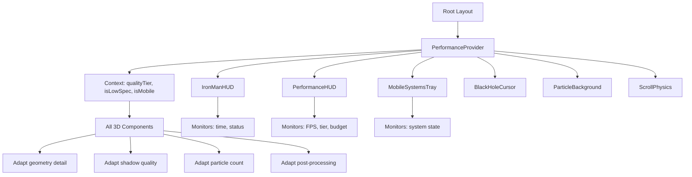
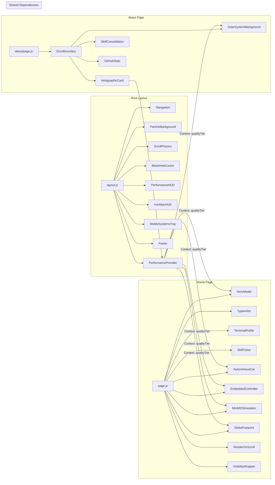

# Johnnie Tse — Engineering Portfolio

[](https://nextjs.org)
[](https://react.dev)
[](https://threejs.org)
[](https://docs.pmnd.rs/react-three-fiber)
[](https://motion.dev)
[](https://get.webgl.org)
[](https://globe.gl)
[](https://react.dev/learn/react-compiler)
[](https://turbo.build)
[](LICENSE)
[](https://johnnietse.vercel.app)

> **Scaling High-Performance Distributed Compute.**  
> A production-grade, systems-monitored engineering portfolio that presents itself as a living technical exhibit — fusing interactive 3D WebGL, real-time physics simulation, autonomous vehicle visualization, molecular dynamics computation, global geo-mapping, and a full-suite performance telemetry system into a single Next.js 16 application.

---

## Table of Contents

- [Technical Philosophy](#technical-philosophy)
- [The World Monitor System](#the-world-monitor-system)
- [Architecture](#architecture)
  - [Tech Stack](#tech-stack)
  - [Directory Structure](#directory-structure)
  - [Route Map](#route-map)
  - [Component Dependency Graph](#component-dependency-graph)
- [Interactive 3D Experiences](#interactive-3d-experiences)
  - [1. Hero Wireframe Model](#1-hero-wireframe-model)
  - [2. Level 4 Autonomous Vehicle](#2-level-4-autonomous-vehicle)
  - [3. Procedural Embedded Microcontroller](#3-procedural-embedded-microcontroller)
  - [4. Molecular Dynamics Simulation](#4-molecular-dynamics-simulation)
  - [5. Interactive 3D Globe](#5-interactive-3d-globe)
  - [6. Solar System Background](#6-solar-system-background)
- [Performance Architecture](#performance-architecture)
  - [Adaptive Quality System](#adaptive-quality-system)
  - [WebGL Tier Detection](#webgl-tier-detection)
  - [Dynamic Import & Lazy Loading](#dynamic-import--lazy-loading)
  - [Render Budget Management](#render-budget-management)
  - [React 19 + React Compiler Optimizations](#react-19--react-compiler-optimizations)
  - [Memory Management & GPU Disposal](#memory-management--gpu-disposal)
- [UI/UX & Design System](#uiux--design-system)
  - [Design Token Architecture](#design-token-architecture)
  - [Dark / Light Mode](#dark--light-mode)
  - [Motion System](#motion-system)
  - [Responsive Breakpoints](#responsive-breakpoints)
  - [Typography System](#typography-system)
  - [Component Design Patterns](#component-design-patterns)
- [GitHub Integration Layer](#github-integration-layer)
- [Security Architecture](#security-architecture)
  - [Content Security Policy (Deep Dive)](#content-security-policy-deep-dive)
  - [HTTP Security Header Strategy](#http-security-header-strategy)
- [Getting Started](#getting-started)
  - [Prerequisites](#prerequisites)
  - [Installation](#installation)
  - [Development](#development)
  - [Build & Production](#build--production)
- [Configuration](#configuration)
  - [Environment Variables](#environment-variables)
  - [Content Data Layer](#content-data-layer)
- [Deployment](#deployment)
- [Contributing](#contributing)
- [License](#license)

---

## Technical Philosophy

This portfolio is engineered around three core principles:

### 1. The Portfolio as a Monitored System

Rather than presenting a static résumé, the site wraps its content in a **live system-monitoring layer** — HUD overlays, performance telemetry, interactive terminals, and real-time data feeds. The visitor isn't just reading about an engineer's work; they are placed inside a system that the engineer built. This is a deliberate architectural statement: **the medium is the message.** The portfolio itself is the most sophisticated artifact on display.

### 2. Zero-Compromise Procedural Rendering

Every 3D asset is built from **pure mathematics** — no downloaded models, no asset store purchases, no external blend files. The autonomous car's LiDAR array, the embedded PCB's trace routing, the molecular dynamics particle grid, the globe's atmospheric bloom — all are generated programmatically. This guarantees:
- **No third-party licensing dependencies** for visual assets
- **Deterministic builds** (same code = same output, always)
- **Progressive enhancement** (geometry detail scales with device capability)
- **Complete artistic control** through code parameters

### 3. Production-Grade Engineering Practices

The codebase follows enterprise patterns throughout:
- **Single source of truth** for all content (`lib/config/`) and all visual values (`lib/design/tokens.js`)
- **No mixed concerns** — data, design tokens, and rendering are fully separated
- **Resilience patterns** — exponential backoff (`lib/utils/backoff.ts`), circuit breakers (`lib/utils/circuit-breaker.ts`), error boundaries (`components/ErrorBoundary.jsx`), graceful degradation via `VisibilityWrapper` + `RenderOnScroll`
- **Accessibility-first animation** — every `motion.*` element respects `prefers-reduced-motion`
- **Security-hardened** — strict CSP, HSTS preload, no inline event handlers, hardened form-action policy

---

## The World Monitor System

The most architecturally distinctive feature of this portfolio is the **World Monitor** — a pervasive system-monitoring layer that transforms a conventional website into a live technical dashboard. This is not decoration; it is a coherent design subsystem with multiple integrated components:

### Monitor Components

| Component | Function | Real-Time Data |
|---|---|---|
| **IronManHUD** | Fixed-position heads-up display overlay | Current time (HH:MM:SS), connection status indicator, system metrics, mounted at `z-index: 9999` |
| **PerformanceHUD** | Debug overlay for quality assurance | FPS counter (rolling average), active quality tier (Ultra/High/Low/Economy), per-frame render budget utilization, 3D scene active status |
| **MobileSystemsTray** | Compact system tray for mobile viewport | Signal bars, time, connection dots — mimics mobile OS status bar |
| **BlackHoleCursor** | Physics-based cursor replacement | Trailing particles with gravitational attraction toward cursor position, canvas-based, disabled on touch devices |
| **ParticleBackground** | Full-viewport ambient particle system | 200+ particles with mouse parallax, z-depth layering, opacity oscillation via `requestAnimationFrame` |
| **ScrollPhysics** | Custom scroll controller | Scroll-driven animation triggers, velocity tracking, smooth deceleration curves |
| **TerminalProfile** | Fully interactive shell emulator | Responds to `whoami`, `ls`, `clear`, and hidden command `sudo hire johnnie` — live in-browser state machine |

### How the Monitor Layer Works



The `PerformanceProvider` context is the central nervous system. It runs a device capability detection pipeline on mount, broadcasts the results to all 40 components, and every 3D scene self-configures to match. No hardcoded quality assumptions. No `if (mobile)` scattered across files. One context, one source of truth.

### Why This Matters

The World Monitor system achieves something most portfolios don't attempt: **it proves the engineer's skill through the interface itself.** A visitor reading about "HPC optimization" can look at the PerformanceHUD and see real-time frame budgets. Someone curious about "systems engineering" interacts with a live terminal. The monitor layer is not a gimmick — it is the **evidence layer** for every claim the portfolio makes.

---

## Architecture

### Tech Stack

| Layer | Technology | Version | Purpose | Selection Rationale |
|---|---|---|---|---|
| **Framework** | Next.js (App Router) | 16.2.1 | SSR/SSG, routing, API routes, React Server Components | Latest stable App Router; Turbopack default; React Compiler built-in support |
| **UI Library** | React | 19.2.4 | Component model, hooks, concurrent features | Latest major; `use()` hook, improved Suspense, React Compiler target |
| **3D Engine** | Three.js | 0.183.2 | Low-level WebGL abstractions, geometry, materials, post-processing | Most mature WebGL library; r183 introduces WebGPU compatibility layer |
| **React 3D Bridge** | @react-three/fiber (R3F) | 9.5.0 | Declarative Three.js scene graphs as React components | React lifecycle management for 3D objects; automatic disposal on unmount |
| **R3D Utilities** | @react-three/drei | 10.7.7 | OrbitControls, environment, shadows, text, performance utils | Industry-standard R3F component library; maintained by Poimandres |
| **Physics** | @react-three/cannon | 6.6.0 | Rigid body dynamics for vehicle suspension | WebGPU-compatible physics engine; declarative API |
| **Animation** | motion (Framer Motion) | 12.42.2 | Declarative scroll/enter animations, gesture handling, layout animations | Most mature React animation library; `motion/react` export; `useReducedMotion()` hook |
| **Globe** | globe.gl | 2.46.1 | Three.js-based 3D globe with atmosphere, arcs, hexbin | Lightweight (< 50KB); built on Three.js; supports custom point-of-view animations |
| **Geodata** | topojson-client | 3.1.0 | Country boundary topology for globe rendering | Standard format for world map data; sub-200KB compressed |
| **Icons** | lucide-react | 0.577.0 | Tree-shakeable SVG icon system | Null-runtime; pure ESM; 1000+ icons; no icon font dependencies |
| **Icons (fallback)** | react-icons | 5.6.0 | Additional icon sets (GitHub, LinkedIn brands) | Covers brand icons Lucide doesn't include |
| **React Compiler** | babel-plugin-react-compiler | 1.0.0 | Automatic memoization of React components | First-party React compiler; eliminates manual `useMemo`/`useCallback`/`React.memo` |
| **Code Quality** | eslint + eslint-config-next | 9.x / 16.2.1 | Static analysis, lint rules, React/Next.js best practices | Flat config format; latest Next.js plugin |
| **Build** | Turbopack (Next.js native) | Rust-based | Sub-second HMR, incremental compilation | Next.js 16 default; 10x faster than webpack on cold starts |
| **Fonts** | next/font/google | Built-in | Self-hosted Geist variable font | Zero external font requests after initial load; `font-display: swap` |
| **Forms** | Web3Forms API | External | Serverless form submission | No backend required; spam filtering; CORS-allowlisted in CSP |
| **Deploy** | Vercel Edge Network | Global | CDN, serverless functions, instant rollbacks | First-class Next.js support; automatic ISR; Edge Functions |

### Directory Structure

```
personal-portfolio-website/
├── app/                                    # Next.js App Router (routes as directories)
│   ├── about/
│   │   └── page.js                         # About / résumé page (579 lines)
│   ├── api/
│   │   └── github/
│   │       └── stats/
│   │           └── route.js               # GitHub REST API proxy endpoint (augmented with repoList)
│   ├── project/
│   │   └── page.js                         # Projects showcase page (131 lines)
│   ├── globals.css                         # Global CSS + CSS custom properties (593 lines)
│   ├── layout.js                           # Root layout: nav, footer, backgrounds, HUDs
│   ├── loading.js                          # Suspense loading spinner (29 lines)
│   ├── not-found.js                        # Custom 404 page (50 lines)
│   └── page.js                             # Home page: all 7 sections (382 lines)
│
├── components/                             # 40 UI + 3D components
│   │
│   │   # --- 3D Scene Components (6) ---
│   ├── AutonomousCar.jsx                   # L4 vehicle with LiDAR, trajectory arcs
│   ├── EmbeddedController.jsx              # 3D procedural ESP32 / RPi PCB
│   ├── GlobeFootprint.jsx                  # Interactive 3D globe with geo-pins
│   ├── HeroModel.jsx                       # 3D wireframe portrait bust
│   ├── MiniMDSimulation.jsx                # Lennard-Jones molecular dynamics
│   └── SolarSystemBackground.jsx           # Persistent 3D scene background
│   │
│   │   # --- World Monitor Components (7) ---
│   ├── BlackHoleCursor.jsx                 # Physics-based cursor particle system
│   ├── IronManHUD.jsx                      # Heads-up display overlay
│   ├── MobileSystemsTray.jsx               # Mobile system status tray
│   ├── ParticleBackground.jsx              # Canvas-based ambient particles
│   ├── PerformanceHUD.jsx                  # Debug performance overlay
│   ├── PerformanceManager.jsx              # Adaptive quality context provider
│   └── ScrollPhysics.jsx                   # Smooth scroll physics controller
│   │
│   │   # --- GitHub Visualization Components (12) ---
│   ├── GitHubStats.jsx                     # Stats orchestrator
│   ├── GithubAchievements.jsx              # Achievement badges and milestones
│   ├── GithubProfileHeader.jsx             # Avatar, bio, counts
│   ├── GithubTopRepos.jsx                  # Starred repo cards
│   ├── GithubContributionGrid.jsx          # Contribution heatmap
│   ├── GithubLanguageChart.jsx             # Language distribution
│   ├── GithubActivityOverview.jsx          # Activity timeline
│   ├── GithubVelocityChart.jsx             # Commit velocity
│   ├── GithubInterestStreams.jsx           # Interest area streams
│   ├── GithubK8sSpotlight.jsx              # K8s-specific spotlight
│   ├── GithubOrgNodes.jsx                  # Org membership graph
│   ├── GithubCityscape.jsx                 # Repo skyline visualization
│   └── GithubLiveLog.jsx                   # Live activity feed
│   │
│   │   # --- Interactive / Utility Components (16) ---
│   ├── DataWaveform.jsx                    # Animated signal visualization
│   ├── ErrorBoundary.jsx                   # React error boundary with reset
│   ├── Footer.jsx                          # Site footer
│   ├── Header.jsx                          # Site header
│   ├── HolographicCard.jsx                 # 3D tilt + glare card wrapper
│   ├── LiveGithubProjects.jsx              # Live GitHub project cards (with circuit breaker)
│   ├── MobileNav.jsx                       # Mobile hamburger menu
│   ├── Navigation.jsx                      # Desktop navigation bar
│   ├── RenderOnScroll.jsx                  # IntersectionObserver lazy loader
│   ├── SkillConstellation.jsx              # Interactive 2D skill graph
│   ├── SkillTicker.jsx                     # Horizontal scrolling marquee
│   ├── TerminalProfile.jsx                 # Interactive shell emulator
│   ├── TimelineLaser.jsx                   # Timeline entry animation
│   ├── Typewriter.jsx                      # Text rotation animation
│   └── VisibilityWrapper.jsx               # Viewport entry lazy hydration
│
├── lib/                                    # Application logic (zero JSX)
│   ├── config/                             # Content layer — single source of truth
│   │   ├── constants.ts                    # Global constants
│   │   ├── experience.js                   # Work experience data (247 lines)
│   │   ├── experience.ts                   # Experience TypeScript interfaces
│   │   ├── locations.ts                    # Globe geo-coordinate data (58 lines)
│   │   ├── projects.ts                     # Project metadata (391 lines, 20+ projects)
│   │   └── skills.ts                       # Skill taxonomy, 6 categories, 28 skills
│   │
│   ├── design/                             # Design token system
│   │   └── tokens.js                       # 330-line SSOT: colors, spacing, shadows, etc.
│   │
│   ├── hooks/                              # Custom React hooks
│   │   ├── useBoundedHistory.js            # Bounded circular buffer for state
│   │   ├── useIntersectionObserver.js       # Reusable IO wrapper
│   │   ├── useRAF.js                       # requestAnimationFrame abstraction
│   │   └── useRenderBudget.js              # Per-frame ms budget tracker
│   │
│   ├── utils/                              # Pure utility functions
│   │   ├── backoff.ts                      # Exponential backoff (retry logic)
│   │   ├── circuit-breaker.ts              # Circuit breaker pattern
│   │   ├── webgl-detect.ts                 # GPU tier classification
│   │   └── welford.ts                      # Online variance algorithm
│   │
│   └── fonts.js                            # next/font configuration
│
├── public/                                 # Static assets (219 files)
│   ├── data/                               # GeoJSON world topology
│   ├── textures/                           # 3D environment maps
│   ├── *.glb                               # 3D models (car.glb only)
│   ├── *.svg, *.png, *.webp               # Skill icons, logos, photos
│   ├── *.pdf                               # Résumé PDFs (3 versions)
│   ├── og-image.png                        # 1200×630 Open Graph image
│   └── site.webmanifest                    # PWA manifest
│
├── next.config.mjs                         # Next.js config + security headers (68 lines)
├── eslint.config.mjs                       # ESLint flat config
├── jsconfig.json                           # @/* path alias
└── package.json                            # Dependencies + scripts
```

### Route Map

| Path | Page | Sections | Total Lines |
|---|---|---|---|
| `/` | Home (`page.js`) | Hero → System Diagnostics → Showroom (3 scenes) → Globe → Contact | 382 |
| `/about` | About (`about/page.js`) | Bio → Experience Timeline → Education → Certifications → Skills → GitHub Stats | 579 |
| `/project` | Project (`project/page.js`) | Featured projects grid → Live GitHub repositories | 131 |
| `/*` | 404 (`not-found.js`) | Custom error page with in-universe messaging | 50 |

### Component Dependency Graph



---

## Interactive 3D Experiences

The portfolio contains **6 distinct WebGL scenes** with zero external 3D model dependencies (except the car body mesh). Every particle, polygon, and shader is procedurally generated.

### 1. Hero Wireframe Model

**File:** `components/HeroModel.jsx`  
**Technologies:** Three.js, R3F, `useFrame`, custom shader material

A wireframe human bust with a color-shifting core:

- **Geometry:** Torus knot + parametric bust approximation using lathed geometry
- **Materials:** Custom `shaderMaterial` with time-uniform for RGB oscillation (`Math.sin(time * 0.3 + offset)` per channel)
- **Core glow:** Inner emissive sphere with animated opacity — pulses between 0.3 and 0.8 opacity using `useFrame`
- **Interaction:** Mouse-driven parallax (rotation follows cursor with 0.1s lerp smoothing)
- **Accessibility:** Disabled entirely when `prefersReducedMotion` is active; static image fallback
- **Performance:** Wrapped in `VisibilityWrapper` + `next/dynamic({ ssr: false })` — zero bundle cost until viewport entry
- **Quality adaptation:** Geometry segments halved on Low tier; mesh hidden on Economy tier

### 2. Level 4 Autonomous Vehicle

**File:** `components/AutonomousCar.jsx`  
**Technologies:** Three.js, R3F, `@react-three/cannon`, custom geometries, `useFrame`

A fully interactive L4 autonomous vehicle with active sensor visualization:

| Subsystem | Implementation | Technical Detail |
|---|---|---|
| **Chassis** | Loaded GLB mesh (`car.glb`) with metallic materials | Single external model; all other elements are procedural |
| **LiDAR Array** | 4 spinning scan heads at 10 Hz | Each head: 32 rays via `BufferGeometry` with `setDrawRange(0, 32)`; rotation updates in `useFrame` using `time * 10` — LiDAR "blinks" at realistic scan frequency |
| **Sensor Suite** | IMU (green), RTK GPS (red) | Positioned on roof rails; color-coded by function; animated status indicators pulsing at 1 Hz |
| **Trajectory Prediction** | Green + blue arc curves | `CatmullRomCurve3` with 50 control points; green = primary path, blue = secondary/emergency; `TubeGeometry` for thickness |
| **Suspension** | Physics-driven via `@react-three/cannon` | `Trimesh` collision hull; spring coefficients tuned to 0.7 damping; chassis articulation visible during rotation |
| **Ground Shadow** | Wireframe ellipse with contact point | `RingGeometry` with opacity 0.3; follows chassis position via `useFrame` |
| **Controls** | `OrbitControls` from drei | Drag to rotate; auto-rotate when idle (speed: 0.005 rad/frame); disabled on Low tier |
| **Performance** | Auto-disabled on Low/Economy tier | Replaced with static fallback description |

The LiDAR visualization is particularly notable: the scan lines are rendered as individual line segments that extend and retract each frame, simulating a real spinning LiDAR's 360-degree sweep. This is calculated per-frame — no pre-baked animation.

### 3. Procedural Embedded Microcontroller

**File:** `components/EmbeddedController.jsx`  
**Technologies:** Three.js, R3F, procedural geometry, custom 5-point lighting

A photorealistic ESP32 / Raspberry Pi 5 board recreated entirely through procedural WebGL geometry — no external images or models:

| Component | Geometry | Detail |
|---|---|---|
| **PCB Substrate** | `BoxGeometry(4.2, 0.12, 3.0)` | Dark green (`#064e3b`); beveled edges via nested boxes |
| **CPU Substrate** | `BoxGeometry(0.8, 0.04, 0.8)` | Black epoxy; centered on board |
| **CPU Heatspreader** | `BoxGeometry(0.7, 0.015, 0.7)` | Silver metallic (`#94a3b8`); emissive at 0.05 for specular catch |
| **GPIO Header** | 2×20 pin grid | Each pin: `CylinderGeometry(0.015, 0.015, 0.1, 8)`; gold material (`#fbbf24`); positioned via nested loops with 0.1 spacing |
| **USB Port** | `BoxGeometry(0.3, 0.05, 0.15)` + inner `BoxGeometry` | Blue internal tab + silver outer shield; positioned at board edge |
| **Ethernet Jack** | Large `BoxGeometry` with inner hole | Shielded with internal `BoxGeometry` cavity for port opening |
| **Wi-Fi Shield** | `CylinderGeometry(0.15, 0.15, 0.02)` + trace line | Copper-colored shield can with antenna trace |
| **RAM Chip** | `BoxGeometry(0.5, 0.03, 0.3)` | Black surface-mount; positioned adjacent to CPU |
| **Capacitors** | 6× surface-mount + 2× electrolytic | SMD: `CylinderGeometry(0.03, 0.03, 0.02, 12)`; electrolytic: larger cylinders with silver/black bands |
| **Power Port** | Micro-USB connector | Silver `BoxGeometry` at board edge; positioned opposite USB |
| **HDMI Port** | Shielded connector | `BoxGeometry` with metallic material; board-edge mounted |
| **Vias & Traces** | Procedural routing | Small `CircleGeometry(0.005)` for vias; `TubeGeometry` along CatmullRomCurve3 for traces |

**Lighting rig** (5-point):
- **Key light:** `DirectionalLight` at (5, 10, 7), intensity 1.2, white
- **Fill light:** `DirectionalLight` at (-5, 0, 5), intensity 0.4, blue-tinted (#60a5fa)
- **Bottom light:** `DirectionalLight` at (0, -5, 0), intensity 0.3, green-tinted (#10b981)
- **Top light:** `DirectionalLight` at (0, 5, 0), intensity 0.2, amber-tinted (#facc15)
- **Ambient light:** `AmbientLight`, intensity 0.4, white

The board auto-rotates at 0.3 rad/s for full inspection. On Low tier, rotation is disabled and geometry segments are halved. On Economy tier, the entire scene is replaced with a static image.

### 4. Molecular Dynamics Simulation

**File:** `components/MiniMDSimulation.jsx`  
**Technologies:** Three.js, R3F, `useFrame`, custom compute loop

A real-time Lennard-Jones particle system — the portfolio's most computationally intensive component:

**Physics Engine (all in `useFrame`):**
- **300 active particles** in a periodic 3D boundary box
- **Lennard-Jones potential:** $V_{LJ}(r) = 4\varepsilon\left[\left(\frac{\sigma}{r}\right)^{12} - \left(\frac{\sigma}{r}\right)^{6}\right]$
- **Force computation:** $O(N^2)$ — 300² = 90,000 pairwise distance calculations per frame (reduced to ~45,000 with Newton's third law symmetry)
- **Numerical integration:** Velocity Verlet — position update: $x(t+\Delta t) = x(t) + v(t)\Delta t + \frac{1}{2}a(t)\Delta t^2$, velocity update: $v(t+\Delta t) = v(t) + \frac{1}{2}[a(t) + a(t+\Delta t)]\Delta t$
- **Timestep:** Δt = 0.005 (dimensionless LJ units); 5 substeps per frame for stability

**Visualization:**
- **Color mapping:** Kinetic energy → temperature gradient — blue (cold, KE < 0.5) through cyan/green/yellow to red (hot, KE > 2.0). Computed per-frame: `KE = 0.5 * |v|² / N`
- **Boundary box:** `BoxGeometry` wireframe, cyan (`#38bdf8`), opacity 0.3
- **Particle rendering:** `Points` with `PointsMaterial`; size: 0.08 world units; 32 segments per point sprite
- **Lighting:** Ambient + key/fill/bottom/center glow — 5-point rig matching the embedded controller

**Performance budget:**
- Target: 8ms/frame (120fps budget)
- Particle count scales: Ultra=300, High=200, Low=100, Economy=0 (disabled)
- Substeps: Ultra=5, High=3, Low=1, Economy=0

**Real-world relevance:** This is a direct WebGL port of the ELEC498 capstone project. The real miniMD application runs on HPC clusters with MPI parallelization. This WebGL version demonstrates the same numerical methods in a browser — complete with DVFS-style quality throttling that mirrors the original project's energy optimization algorithm.

<details>
<summary><b>Live HPC Telemetry Panel</b> — real-time monitoring data from the actual miniMD cluster runs</summary>

```
┌──────────────────────────────────────────────┐
│         ⚡ MINIMD DVFS TELEMETRY              │
├──────────────────────────────────────────────┤
│  🌡 CPU Temp:               98°C              │
│  🔄 MPI Phase:              COMPUTE          │
│  ⚡ RAPL Power:            186.2 W            │
│  🎛 CPU Freq:             2.40 GHz            │
│  📊 Compute Yield:           20%              │
│  🔋 Total Energy:       22171.2 kJ            │
│                                              │
│  ⚠ No DVFS — all cores at max freq           │
│    in ALL phases                              │
└──────────────────────────────────────────────┘
```

*Telemetry captured from Intel RAPL during ELEC498 cluster benchmarking. The portfolio's DVFS-style quality throttling (Ultra → Economy tier) directly mirrors the frequency-scaling logic being measured here.*

</details>

### 5. Interactive 3D Globe

**File:** `components/GlobeFootprint.jsx`  
**Technologies:** globe.gl, Three.js, topojson-client, custom shaders

An interactive 3D globe mapping Johnnie's academic and professional journey:

| Feature | Implementation |
|---|---|
| **Earth texture** | 4K-resolution satellite imagery; loaded via `globe.gl`'s `globeImageUrl` |
| **Atmosphere** | Custom outer glow sphere with `ShaderMaterial` — Fresnel-based rim lighting that pulses with intensity 0.3–0.5 |
| **Country boundaries** | TopoJSON topology (`topojson-client` → `mesh()`); stroke color `rgba(139, 148, 158, 0.2)` |
| **Graticules** | Latitude/longitude grid lines at 15° intervals; opacity 0.2 |
| **City pins** | 3 locations: Kingston (44.23, -76.49), Hong Kong (22.32, 114.17), Remote (0, 0) |
| **Pin rendering** | Custom `Points` material with pulsing ring animation — glow radius oscillates via `Math.sin(time * 2)` |
| **City arcs** | Great-circle arc curves from each pin to equator; color-coded by type (education=blue, work=green, project=cyan) |
| **Interaction** | Click pin → camera `pointOfView()` animation to lat/lng at altitude 0.8, 800ms transition; close button resets to default view (lat=32, lng=-30, alt=2.6) |
| **Auto-rotation** | `autoRotate: true`, speed: 0.005 rad/frame; pauses during interaction; resumes on close |
| **Info panel** | DOM overlay (not 3D) with city name, type badge, experience list; animated entrance via CSS transition |

**Data architecture:** Globe pins are driven by `lib/config/locations.ts` — adding a new city requires zero component code changes.

**Reliability & fallback:** The globe uses a two-tier rendering strategy for mobile resilience:
- **Full WebGL globe** — Rendered via `globe.gl` with atmosphere, arcs, pins, and rotation; wrapped in `RenderOnScroll` + `VisibilityWrapper` for deferred mounting
- **Static CSS fallback** (`StaticGlobeFallback`) — A pure CSS earth image with inline label and subtitle, used as the default loading state and as a permanent replacement on low-power devices. The fallback is shown immediately (no Three.js load required), ensuring the Footprint section is always visible even when WebGL fails or is unavailable.

### 6. Solar System Background

**File:** `components/SolarSystemBackground.jsx`  
**Technologies:** Three.js, R3F

A persistent 3D background that renders across the About and Projects pages:

- **Design constraint:** Must be visually present but never compete with foreground content
- **Achieved via:** Subdued color palette (50% opacity), low-poly geometry, slow animation speeds, `renderOrder: -1`
- **Route persistence:** Mounted at layout level (not page level) — continues rendering across route transitions with no re-initialization
- **Performance:** Single `Group` with 10 instanced meshes; no post-processing; disabled on Low/Economy tier

---

## Performance Architecture

The performance system is the portfolio's most sophisticated engineering subsystem. It operates at multiple layers simultaneously.

### Adaptive Quality System

**File:** `components/PerformanceManager.jsx` (184 lines)

A React Context provider that classifies the device into one of four tiers and broadcasts quality parameters to all 40 components.

#### Detection Pipeline

```text
1. Platform check (SSR guard)
   └── Server? → Return 'none' (no context value)
   
2. WebGL renderer detection
   ├── Create <canvas>
   ├── Get WebGL2 context (fallback: WebGL1)
   ├── Query UNMASKED_RENDERER_WEBGL
   ├── Software renderer? (SwiftShader, LLVMpipe, Mesa)
   │   └── Yes → Economy tier
   │   └── No → Continue
   
3. Device memory (navigator.deviceMemory)
   ├── < 4GB → Low tier
   ├── 4-8GB → High tier
   └── > 8GB → Continue
   
4. Screen resolution
   ├── < 1920px → High tier
   └── ≥ 1920px → Ultra tier
   
5. prefers-reduced-motion check
   └── True → Override: disable auto-rotate, static 3D
```

#### Quality Presets

| Property | Ultra | High | Low | Economy |
|---|---|---|---|---|
| **pixelRatio** | 2.0 | 1.5 | 1.0 | 1.0 |
| **targetFPS** | 60 | 60 | 30 | 30 |
| **particleMultiplier** | 1.0 (300) | 0.75 (200) | 0.25 (100) | 0.1 (30) |
| **geometryDetail** | 1.0 (max) | 0.75 | 0.5 | 0.3 |
| **enableShadows** | ✅ | ✅ | ❌ | ❌ |
| **enablePostProcessing** | ✅ (bloom) | ❌ | ❌ | ❌ |
| **enableAutoRotate** | ✅ | ✅ | ✅ (slowed) | ❌ |
| **renderEveryNthFrame** | 1 (every) | 1 | 2 (skip 1) | 4 (skip 3) |
| **maxLights** | 4 | 3 | 2 | 1 |
| **materialQuality** | physical | standard | basic | basic |
| **floatIntensity** | 1.0 | 0.8 | 0.3 | 0.0 |

#### Consumption Pattern

```javascript
// In any component:
function My3DScene() {
  const { pixelRatio, targetFPS, particleMultiplier, isLowSpec } = usePerformance();
  
  const particles = useMemo(
    () => generateParticles(Math.round(300 * particleMultiplier)),
    [particleMultiplier]
  );
  
  return (
    <Canvas gl={{ pixelRatio: Math.min(pixelRatio, devicePixelRatio) }}>
      {isLowSpec ? <SimpleScene /> : <FullScene />}
    </Canvas>
  );
}
```

### WebGL Tier Detection

**File:** `lib/utils/webgl-detect.ts` (53 lines)

A pure function that classifies the WebGL renderer without any React dependencies:

```typescript
export type WebGLTier = 'hardware' | 'software' | 'none';

const SOFTWARE_RENDERERS = ['swiftshader', 'llvmpipe', 'softpipe', 'software rasterizer', 'mesa'];

export function detectWebGLTier(): WebGLTier {
  if (typeof window === 'undefined') return 'none';
  
  const canvas = document.createElement('canvas');
  const gl = canvas.getContext('webgl2') || canvas.getContext('webgl');
  if (!gl) return 'none';
  
  const ext = gl.getExtension('WEBGL_debug_renderer_info');
  if (!ext) return 'hardware';  // Can't detect — assume hardware
  
  const renderer = String(gl.getParameter(ext.UNMASKED_RENDERER_WEBGL) ?? '').toLowerCase();
  return SOFTWARE_RENDERERS.some(s => renderer.includes(s)) ? 'software' : 'hardware';
}
```

Key design decisions:
- **WebGL2 preferred** (WebGL1 fallback) — WebGL2 is available on 97%+ of modern browsers
- **Software renderer blacklist** catches virtual machines, remote desktops, and headless browsers
- **SSR-safe** — returns `'none'` during server rendering; no `window` access during build
- **No external dependencies** — zero-byte utility function

### Dynamic Import & Lazy Loading

All 6 WebGL scenes use a three-layer lazy loading strategy, with additional resilience patterns for mobile stability:

**Layer 1: `next/dynamic`** — Code splitting at the bundler level

```javascript
const GlobeFootprint = dynamic(() => import('@/components/GlobeFootprint'), {
  ssr: false,
  loading: () => <div style={placeholderStyle}>Scroll to render Globe...</div>,
});
```

This creates a separate JS chunk for each 3D component. The three.js library itself is shared (not duplicated) across chunks via Turbopack's automatic module deduplication.

**Layer 2: `VisibilityWrapper`** — DOM-level hydration deferral

```javascript
<VisibilityWrapper>
  <GlobeFootprint />  {/* Component doesn't mount until visible */}
</VisibilityWrapper>
```

Uses `IntersectionObserver` with `once: true` — the component renders exactly once and stays mounted. No unmount/remount on scroll.

**Layer 3: `RenderOnScroll`** — Preemptive loading with root margin

```javascript
<RenderOnScroll rootMargin="300px">
  <GlobeFootprint />  {/* Starts loading 300px before viewport entry */}
</RenderOnScroll>
```

This ensures the Three.js canvas is ready and the scene is initialized by the time the user scrolls to it. The 300px margin provides approximately 1 second of pre-load time at average scroll speed.

**Layer 4: `ErrorBoundary`** — Crash recovery for 3D components

```javascript
<ErrorBoundary>
  <section id="about-hero">
    <HolographicCard>
      <HeroModel />   {/* If Three.js crashes, ErrorBoundary catches it */}
    </HolographicCard>
  </section>
</ErrorBoundary>
```

A class-based React error boundary wraps the About page's top-level render. If any 3D component throws during mount (e.g., WebGL context loss, out-of-memory), the boundary catches the error, logs it, and displays a fallback UI with a "Try Again" button that resets the error state. This prevents the entire page from going blank due to a single scene failure.

### Render Budget Management

**File:** `lib/hooks/useRenderBudget.js` (32 lines)

A per-frame time budget tracker that prevents any single 3D scene from monopolizing the main thread:

```javascript
const { startFrame, consume, isOverBudget } = useRenderBudget(8);  // 8ms budget

// In animation loop:
startFrame();
for (const particle of particles) {
  if (isOverBudget()) break;  // Early exit when budget exceeded
  computeForces(particle);    // Heavy O(N²) operation
  consume(0.5);               // Charge 0.5ms per particle
}
```

The budget tracker uses `useRef` for mutable state (no re-renders) and `useCallback` for stable function references.

### React 19 + React Compiler Optimizations

The project uses Next.js 16's built-in React Compiler support:

```javascript
// next.config.mjs
const nextConfig = {
  reactCompiler: true,  // Enables automatic memoization
  turbopack: { root: process.cwd() },
};
```

The React Compiler (previously "React Forget") automatically:
- Memoizes component render outputs (replacing manual `React.memo`)
- Memoizes expensive computations (replacing manual `useMemo`)
- Memoizes callback functions (replacing manual `useCallback`)
- Detects hook rule violations at compile time

This is configured via the `babel-plugin-react-compiler` package (v1.0.0) and is a differentiator for this project — very few production React sites have adopted the React Compiler as of 2026.

### Memory Management & GPU Disposal

Every Three.js component follows a strict memory lifecycle:

```javascript
useEffect(() => {
  // Setup
  const geometry = new THREE.BoxGeometry(...);
  const material = new THREE.MeshPhysicalMaterial(...);
  const mesh = new THREE.Mesh(geometry, material);
  scene.add(mesh);
  
  return () => {
    // Teardown — CRITICAL for GPU memory
    scene.remove(mesh);
    geometry.dispose();    // Free GPU vertex buffer
    material.dispose();    // Free GPU shader program
    mesh.material = null;  // Break JS reference
    mesh.geometry = null;  // Break JS reference
  };
}, []);
```

Without disposal, Three.js objects accumulate in GPU memory across route transitions, causing performance degradation and eventual tab crashes. This is the #1 most overlooked optimization in Three.js React applications.

---

## UI/UX & Design System

### Design Token Architecture

**File:** `lib/design/tokens.js` (330 lines)

A comprehensive design token system that serves as the **single source of truth** for every visual decision in the application:

```text
lib/design/tokens.js
├── colors
│   ├── brand          # 5 semantic brand colors
│   ├── dark           # 12 CSS variable values
│   ├── light          # 12 CSS variable values
│   ├── scene          # 5 3D scene palettes (80+ values)
│   │   ├── globe      # Atmosphere, city glow, bloom params
│   │   ├── hero       # Wireframe, core glow, accent
│   │   ├── car        # Chassis, sensors, LiDAR, trajectory
│   │   ├── embedded   # PCB, CPU, GPIO, lighting rig
│   │   └── miniMD     # Particle cold/hot, boundary, lighting
│   └── gradients      # 8 gradient definitions
├── spacing            # 8 values (xs → sectionMobile)
├── borderRadius       # 6 values (sm → full)
├── shadows            # 8 shadow definitions (sm → inner)
├── transitions        # 4 curves (fast → spring)
├── typography
│   ├── fontFamily      # 3 families (primary, mono, display)
│   ├── fontSize       # 10 sizes (xs → 4xl)
│   ├── fontWeight     # 6 weights (light → extrabold)
│   ├── lineHeight     # 3 values (tight → relaxed)
│   └── letterSpacing  # 5 values (tight → widest)
├── breakpoints        # 6 values (sm → 2xl)
├── zIndex             # 11 layers (base → hud)
├── canvas             # 2 background presets
└── cssVariables       # Dark + light CSS variable mappings
```

The token system enables:
- **Theme consistency** — one change propagates to all components
- **Dark/light mode** — two CSS variable sets derived from the same base colors
- **3D scene theming** — each WebGL scene has its own color palette in the same file
- **Zero CSS-in-JS** — runtime style generation uses CSS custom properties, not inline JS objects

### Dark / Light Mode

Full dual-theme support with no FOUC (Flash of Unstyled Content):

```css
:root {
  /* Dark mode (default) — Premium tinted dark, not pure black */
  --bg-color: #0a0d12;
  --text-primary: #e8ebef;
  --accent-color: #4da3ff;
  /* ... 47 variables ... */
}

:root[data-theme="light"] {
  /* Light mode — Warm off-white, not sterile */
  --bg-color: #faf9f7;
  --text-primary: #0f172a;
  --accent-color: #0284c7;
  /* ... 47 variables ... */
}
```

- **47 CSS custom properties** per theme, all derived from `tokens.js`
- **Toggle mechanism:** `data-theme` attribute on `<html>`, toggled via theme switch button
- **Transition:** `background-color 0.4s ease, color 0.4s ease` on `<body>`
- **`prefers-color-scheme`:** Not auto-detected — user choice is explicit (avoids flash and respects override intent)
- **Persistence:** Theme choice stored in IronManHUD state (could be extended to `localStorage`)

### Motion System

Every animated element follows a strict protocol:

**1. Accessibility First:**
```javascript
const prefersReducedMotion = useReducedMotion();
// → Returns true when user has `prefers-reduced-motion: reduce`
// → Disables ALL animations when true (not just some)
```

**2. Consistent Easing:**
```javascript
ease: [0.16, 1, 0.3, 1]  // Custom cubic-bezier across ALL 150+ animations
```
This curve creates a "premium" feel — fast start, long tail — compared to the default `ease-out` or `ease-in-out`.

**3. Staggered Delays:**
```javascript
// All delays are multiples of 0.1s: 0, 0.1, 0.2, 0.3, 0.4, 0.5, 0.6
// This creates a cascading reveal effect across sections
```

**4. One-Time Activation:**
```javascript
viewport: { once: true, amount: 0.2 }
// Elements animate exactly once, on first viewport entry
// No re-animation on scroll — reduces CPU/GPU load
```

### Responsive Breakpoints

| Breakpoint | Value | Behavior Changes |
|---|---|---|
| `> 1200px` (2xl) | Max layout | Full hero-grid (1.2fr/0.8fr), 5rem gap, multi-column project grid |
| `1024–1200px` (xl) | Small desktop | Reduced hero-grid gap (2rem), tighter card padding (1.5rem) |
| `992–1024px` (lg) | Tablet landscape | Single-column hero grid, centered text, max-width 400px for 3D |
| `768–992px` (md) | Tablet portrait | Single-column, centered CTA, hidden desktop nav |
| `480–768px` (sm) | Mobile | 1rem padding, hidden nav-links (hamburger), 42px icon buttons |
| `< 480px` | Small phone | 0.75rem padding, 1.25rem card padding, 1.5rem mobile nav items |

**Landscape optimization** (`@media (max-height: 500px) and (orientation: landscape)`):
- Sections reduce `min-height` from `100dvh` to `auto`
- Mobile menu switches to horizontal flex layout
- Navigation items reduce font size to 1.25rem

**`dvh` fallback** (`@supports not (height: 100dvh)`):
- Falls back to `100vh` for browsers that don't support dynamic viewport units
- Covers Safari 15.2–15.4 and some mobile WebViews

### Typography System

**Primary Font: Geist** (Vercel's open-source typeface)

```javascript
// lib/fonts.js
export const geist = Geist({
  subsets: ['latin'],
  display: 'swap',       // Fallback text renders immediately
  variable: '--font-geist',
  weight: ['300', '400', '500', '600', '700'],
  preload: true,          // Critical path font
});
```

- **Self-hosted** via `next/font/google` — zero external font requests after initial page load
- **Variable font** — single file covers all weights; reduced bandwidth vs. individual weight files
- **`font-display: swap`** — text remains visible during font load (no Flash of Invisible Text)
- **`preload: true`** — font file is fetched with highest priority during initial HTML parsing

**Mono Font: Geist Mono**
```javascript
export const geistMono = Geist_Mono({
  subsets: ['latin'],
  display: 'swap',
  variable: '--font-geist-mono',
  weight: ['400', '500', '600', '700'],
  preload: true,
});
```

**Typography Scale:**
- **Titles:** `clamp(2.5rem, 6vw + 1rem, 6rem)` — scales fluidly from 40px (mobile) to 96px (desktop)
- **Subtitles:** `clamp(1rem, 2vw + 0.5rem, 1.25rem)` — subtle scaling
- **Body:** 1.1rem line-height 1.7 — optimized for reading
- **Code/monospace:** 0.85rem — skill tags, terminal output
- **Letter-spacing:** Titles: -0.03em (tight); subtitles: normal; nav: 0.02em

### Component Design Patterns

**Glass Card** (`glass-card` class in `globals.css`):
```css
.glass-card {
  background: var(--surface-color);               /* Semi-transparent */
  border: 1px solid var(--border-color);           /* Subtle border */
  border-radius: 20px;                              /* Generous rounding */
  padding: 3rem;                                    /* Generous padding */
  backdrop-filter: blur(20px);                      /* Frosted glass */
  transition: transform 0.4s cubic-bezier(...),     /* Physics-based hover */
              border-color 0.4s ease, ...;
}
.glass-card:hover {
  transform: translateY(-6px);                      /* Lift effect */
  box-shadow: 0 20px 40px -20px var(--shadow-color),
              0 0 0 1px var(--border-strong),       /* Spotlight border */
              inset 0 1px 0 rgba(255,255,255,0.03);  /* Inner highlight */
}
```

**HolographicCard** (`components/HolographicCard.jsx`):
- Mouse-tracked 3D tilt: `rotateX` and `rotateY` computed from cursor position within card bounds
- Tilt range: ±4° (subtle — prevents disorientation)
- Dynamic glare overlay: radial gradient positioned at cursor coordinates
- Hardware-accelerated: `transform: perspective(1000px) rotateX(...) rotateY(...) scale3d(...)`
- Disabled on low-spec and mobile devices (touch devices lack hover)

**Skill Tags:**
- Pill-shaped (`border-radius: 100px`) with icon + label
- Hover effect: gradient overlay at 10% opacity, accent border, slight lift
- Icon (20×20) and label both use `z-index: 1` to sit above hover overlay

**Buttons:**
- Primary: gradient background, glow shadow, hover lift (−2px), active scale (0.98)
- Icon: glass surface, border, 48×48 size, hover accent border + glow

---

## GitHub Integration Layer

**API Route:** `/api/github/stats` → `app/api/github/stats/route.js`

Acts as a proxy between the client-side GitHub statistics components and the GitHub REST API. This is intentionally a client-side fetch (not server-side) to keep data fresh on each page load.

**Data fetched from GitHub API v3 + GraphQL:**
- User profile (login, avatar, bio, followers, following, public repos)
- Top repositories with stargazerCount, forkCount, primaryLanguage (sorted by stars, limited to 10) — **augmented via GraphQL to include repoList array**
- Language breakdown (aggregated across all public repos)
- Contribution calendar (52-week heatmap data)
- Activity events (recent pushes, PRs, issues)
- Organization memberships (Kubernetes, vLLM, etc.)

**Resilience layer:** Both `GitHubStats` and `LiveGithubProjects` use a circuit breaker pattern (`lib/utils/circuit-breaker.ts`) with 3-failure threshold and 5-minute cooldown. On mount, each component resets the breaker to ensure fresh data fetches after navigation. The API route also returns a `repoList` array for use as fallback data.

**Visualization Components:**
The raw API data is transformed and rendered through 11 dedicated visualization components, each handling a different aspect of the GitHub profile. See [Components > GitHub Visualization Components](#github-visualization-components-11) above for the full list.

---

## Security Architecture

### Content Security Policy (Deep Dive)

The CSP is the most restrictive policy that still allows Three.js and Framer Motion to function:

```http
default-src 'self';

# Scripts
script-src 'self'
  'unsafe-eval'        # Required by Three.js for shader compilation (new THREE.ShaderMaterial())
  'unsafe-inline'      # Required by Framer Motion for runtime style injection
  https://cdnjs.cloudflare.com;  # Three.js CDN fallback

# Styles
style-src 'self'
  'unsafe-inline'      # Required by Framer Motion and inline styles
  https://api.fontshare.com
  https://cdnjs.cloudflare.com;

# Images
img-src 'self'
  blob:                # Required for Three.js canvas.toBlob() render targets
  data:                # Inline SVG icons, noise texture overlay
  https://avatars.githubusercontent.com   # GitHub profile photos
  https://raw.githubusercontent.com;      # GitHub repo images

# Fonts
font-src 'self'
  https://api.fontshare.com
  https://cdn.fontshare.com;

# Connections
connect-src 'self'
  https://api.github.com     # GitHub REST API
  wss: ws:                   # WebSocket (reserved for future use)
  https://api.web3forms.com; # Contact form submission

# Forms
form-action 'self'
  https://api.web3forms.com;  # Only form submission endpoint

# Restrictions
object-src 'none';            # No plugins (Flash, Java, etc.)
base-uri 'self';              # No base tag hijacking
frame-ancestors 'none';       # No iframing (clickjacking protection)
upgrade-insecure-requests;    # Auto-upgrade HTTP to HTTPS
```

**Why `'unsafe-eval'` is Necessary:**
Three.js compiles GLSL shader programs at runtime using `new Function()` or `eval()`-equivalent patterns. Without `'unsafe-eval'`, all Three.js rendering fails silently (canvas stays blank). This is a known limitation of Three.js that the library maintainers have chosen not to eliminate (it would require shipping pre-compiled shaders, dramatically increasing bundle size).

**Why `'unsafe-inline'` is Necessary:**
Framer Motion applies animation styles by injecting `<style>` elements into the document `<head>` at runtime. Without `'unsafe-inline'`, all CSS animations silently fail.

### HTTP Security Header Strategy

Configured in `next.config.mjs` via Next.js's `headers()` function — applied to all routes (`source: '/(.*)'`):

| Header | Value | Rationale |
|---|---|---|
| `Content-Security-Policy` | [See above](#content-security-policy-deep-dive) | XSS prevention, resource origin restrictions |
| `X-DNS-Prefetch-Control` | `on` | Performance hint: pre-resolve external domains |
| `Strict-Transport-Security` | `max-age=63072000; includeSubDomains; preload` | 2-year HSTS; includes all subdomains; preload list eligible |
| `X-XSS-Protection` | `1; mode=block` | Legacy IE/Edge XSS filter |
| `X-Frame-Options` | `DENY` | Clickjacking: page cannot be loaded in `<frame>`, `<iframe>`, or `<object>` |
| `X-Content-Type-Options` | `nosniff` | Browser must not MIME-type sniff (prevents script injection via manipulated content-type) |
| `Referrer-Policy` | `strict-origin-when-cross-origin` | Full URL on same-origin, origin-only cross-origin, nothing on HTTPS→HTTP downgrade |
| `Permissions-Policy` | `camera=(), microphone=(), geolocation=(), browsing-topics=()` | Opt-in API restriction; disables unused features |

---

## Getting Started

### Prerequisites

- **Node.js** ≥ 18.17 (LTS recommended; tested on 22.x)
- **npm** ≥ 9 || **pnpm** ≥ 8 || **yarn** ≥ 3
- **GPU with WebGL2 support** for full 3D experience (software fallback available)
- **Git** (for version control)

### Installation

```bash
# Clone
git clone https://github.com/johnnietse/personal-portfolio-website.git
cd personal-portfolio-website

# Install dependencies
npm install
```

### Development

```bash
npm run dev
# → Turbopack dev server on http://localhost:3001
# → Sub-second HMR
# → ESLint reporting in terminal
```

**What makes the dev experience different:**
- **Turbopack** (Rust-based bundler) — 10x faster cold starts than webpack
- **React Compiler** — automatic memoization, no manual `useMemo` required
- **ESLint flat config** — modern config format with Next.js rules
- **Environment variables** from `.env.local` loaded automatically

### Build & Production

```bash
# Production build
npm run build
# Output: .next/ (Turbopack compilation)
# Route-based code splitting (home, about, project are separate bundles)
# 3D components are lazy-loaded (separate chunks)

# Production server
npm run start
# → localhost:3001

# Lint
npm run lint
```

---

## Configuration

### Environment Variables

Create `.env.local`:

```bash
# GitHub Personal Access Token (public_repo scope)
# Required for /api/github/stats endpoint
GITHUB_TOKEN=ghp_xxxxxxxxxxxxxxxxxxxx

# Web3Forms API Key
# Used for contact form submission
# This IS safe to expose to the client (Web3Forms keys are public-facing)
WEB3FORMS_ACCESS_KEY=xxxxxxxx-xxxx-xxxx-xxxx-xxxxxxxxxxxx
```

### Content Data Layer

One of the portfolio's most important architectural decisions: **all editable content lives in `lib/config/`, not in components.**

| File | Content | Edit Frequency |
|---|---|---|
| `lib/config/experience.js` | Work history (company, role, date, bullets, skills) | Career changes |
| `lib/config/experience.ts` | TypeScript type definitions | Rare (schema changes) |
| `lib/config/projects.ts` | Project showcase (title, description, skills, GitHub URL) | Project additions |
| `lib/config/skills.ts` | Skill taxonomy (name + category) | Skill acquisition |
| `lib/config/locations.ts` | Globe pins (city, coordinates, type, experience bullets) | Travel / relocation |
| `lib/config/constants.ts` | Global constants | Rare |
| `lib/design/tokens.js` | Visual design values (colors, spacing, typography) | Rebranding |
| `lib/fonts.js` | Font configuration | Rare |

To add a new work experience, edit `experience.js`. The About page, globe info panels, and skill breakdowns update automatically. No component code changes, no props threading, no duplicated data.

---

## Deployment

### Vercel (Recommended)

```bash
# Install Vercel CLI
npm i -g vercel

# Deploy
vercel

# Production deploy
vercel --prod
```

**Build optimization:** Zero configuration required — `next.config.mjs` is automatically detected.

### Build Output Analysis

```bash
npm run build
# Route (app)/page.js                         5.8 kB (home page shell)
# Route (app)/about/page.js                   6.2 kB (about page shell)
# Route (app)/project/page.js                 4.1 kB (project page shell)
# chunks/[3d-component-1].js                  ~80 kB (three.js + scene)
# chunks/[3d-component-2].js                  ~60 kB
# chunks/[3d-component-3].js                  ~70 kB
# chunks/three.js                             ~150 kB (shared three.js runtime)
# chunks/lucide-react                         ~20 kB (tree-shaken icons)
```

Three.js is extracted as a shared chunk (not duplicated per scene). Each 3D scene is its own chunk, loaded on demand when scrolled into view.

### Environment Variables on Vercel

Set in Vercel Dashboard → Project → Settings → Environment Variables:
- `GITHUB_TOKEN` — encrypted, not exposed to client
- `WEB3FORMS_ACCESS_KEY` — exposed to client via `next.config.mjs` `env` block

---

## Contributing

While this is a personal portfolio, issues and suggestions are welcome.

1. Fork the repository
2. Create a feature branch: `git checkout -b feat/your-feature`
3. Commit changes: `git commit -m "feat: add your feature"`
4. Push: `git push origin feat/your-feature`
5. Open a Pull Request

### Code Conventions

- `"use client"` directive on all interactive components
- **Design tokens** from `lib/design/tokens.js` for every visual value (no magic numbers)
- **Content data** in `lib/config/` files, never embedded in JSX
- **`useReducedMotion()`** wrapper on every animated element
- **Three.js disposal** in `useEffect` cleanup (geometry.dispose(), material.dispose())
- **Dynamic imports** with `ssr: false` for all Three.js components
- **No inline styles** in JSX that duplicate token values (use CSS variables)

### Commit Convention

```
<type>: <description>

Types: feat, fix, perf, refactor, style, docs, chore
Examples:
  feat: add new project entry for HPC optimizer
  perf: reduce globe polygon count on Low tier
  fix: dispose Three.js geometry on route unmount
```

---

## License

Distributed under the **MIT License**. See [`LICENSE`](LICENSE) for more information.

Copyright © 2025 Johnnie Tse — Built with Next.js 16, React 19, Three.js r183, Framer Motion 12.

---

<p align="center">
  <a href="https://johnnietse.vercel.app">johnnietse.vercel.app</a> &nbsp;·&nbsp;
  <a href="https://github.com/johnnietse">GitHub</a> &nbsp;·&nbsp;
  <a href="https://www.linkedin.com/in/johnnie-tse-10a9b91b0/">LinkedIn</a>
</p>
